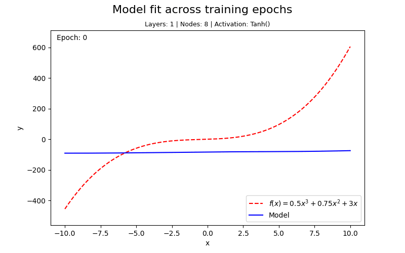
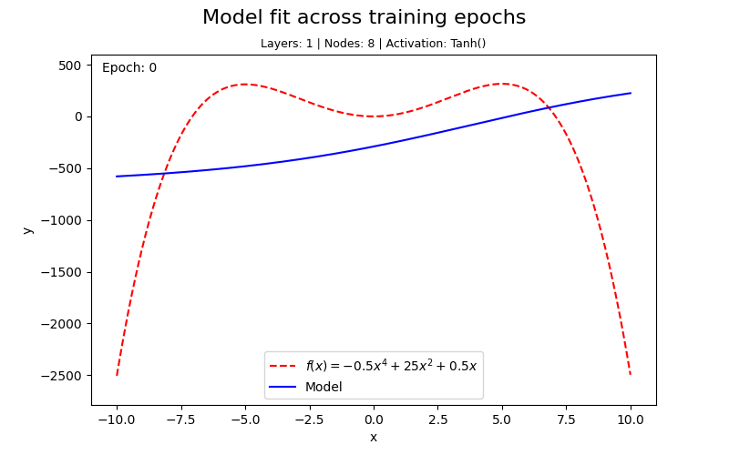
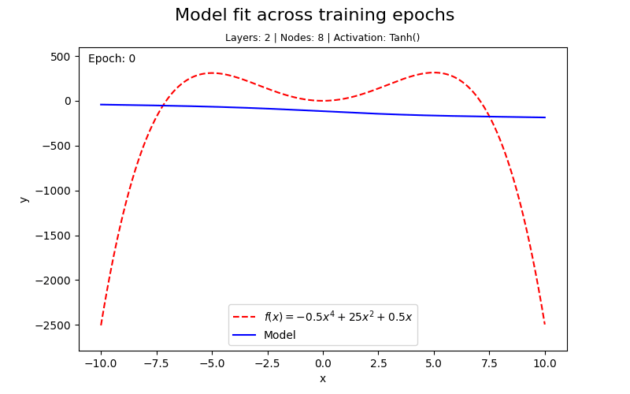
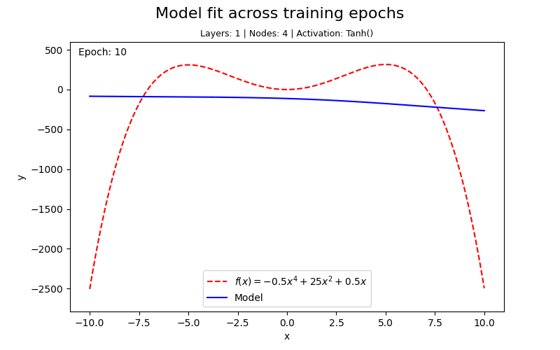

The Universal Approximation Theorem states that a mathematical neural network model can approximate any continuous function, and hence any polynomial, as long as the model structure is complex enough, which can be achieved via hyperparameter tuning. Here I explore this concept by using PyTorch to create neural networks that approximate polynomials and use interesting visualizations to see how it happens.

## Results

I knew that this approach would work, but I greatly underestimated how simple the model can be and still replicate the polynomial. For example, starting with a degree 3 polynomial, even a single layer with 8 nodes can easily approximate the curve in just a few hundred epochs of training:

Complicating the polynomial to degree 4 proves to be slightly more challenging for a model with the same architecture:

But adding even one more layer with the same number of nodes allows for replication in a very short training window:

I wanted to see how simple the model could be and still approximate the curve near-perfectly (given enough training) but lowering the node count to 4 with only one layer shows that the simplicity is limiting as the training gains plateau without achieving a perfect fit:

_Future Plans: (1) Generate a few more test cases, both for very simple polynomials/models and very complex ones. (2) I'd like to use this framework to empirically test how the complexity of the model needs to scale to reach a certain degree of accuracy. I think there are some interesting visualizations possible with this._

## Technical Approach
### Architecture

Use the file `nn_poly_approx.py` as the main file for training neural networks on polynomials and exporting visualizations.

A simple feedforward neural network is trained on synthetically generated data drawn from a user-specified polynomial. The polynomial is defined symbolically using SymPy. The network takes a single scalar input $x$ and produces a single scalar output $\hat{y}$, learning to map the input domain to the polynomial's range.

Training data is generated as linearly spaced points over a specified interval, normalized, and split into training and test sets. The model is trained using mini-batch gradient descent with the Adam optimizer and MSE loss. At regular intervals during training, snapshots of the model's predictions are captured via a callback function, which are later used to produce visualizations of the training process.

The `NeuralNetwork` class accepts `num_layers`, `layer_size`, and `activation` as constructor arguments, building the layer stack programmatically. This makes it straightforward to sweep over architectural configurations without modifying the class itself, a natural fit for experiments studying how network capacity relates to polynomial complexity. 

_Future Plans: I'd like to implement these arguments, number of epochs, and the polynomial specification itself as an input file, so the main approximation code itself won't need to be changed. Update: Moved the specifications to the beginning of the file, so the file is at least easier to use in the meantime. I may still add the input file._

### Visualizations

Two visualization modes are supported:

- **Interactive Plotly slider** — renders in a notebook or browser, allowing the user to scrub through epochs manually and observe the model's predictions shift toward the true function.
- **Animated GIF** — produced using Matplotlib's `FuncAnimation` and `PillowWriter`, showing the same convergence process as an exportable, shareable animation. This functionality is what I used to generate the above GIFs.

### Dependencies

- `torch` — model definition, training, and inference
- `numpy` — data generation and array manipulation
- `sympy` — symbolic polynomial definition and LaTeX rendering
- `matplotlib` — animated GIF output and static plots
- `plotly` — interactive epoch slider visualization
- `Pillow` — GIF export via `PillowWriter`
